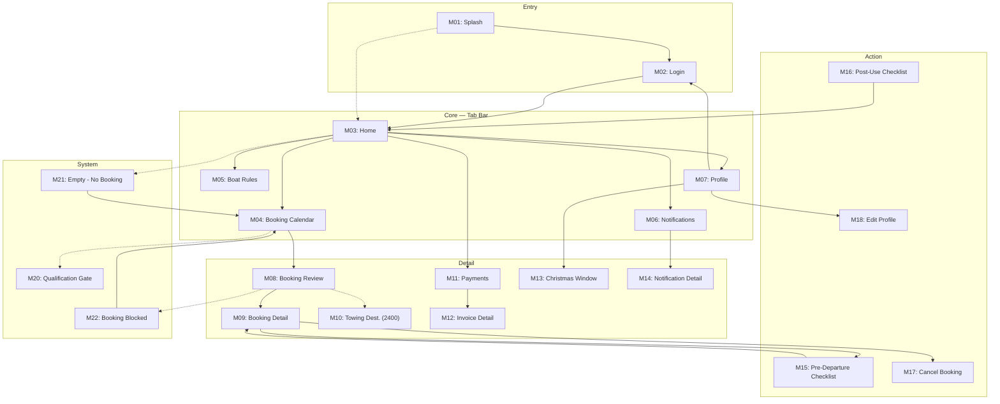
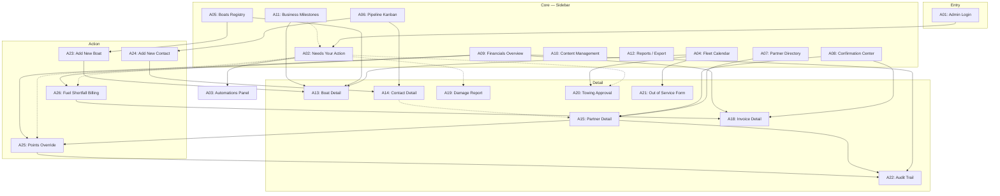
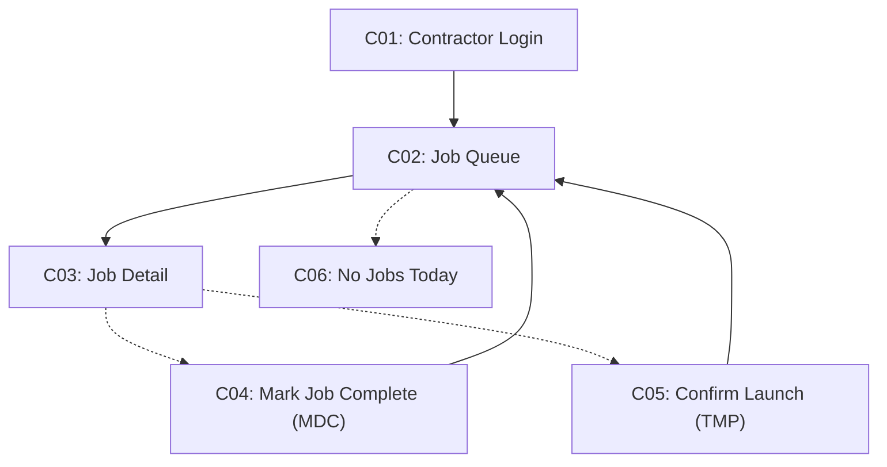

# Offshore Collective — Information Architecture

**Client:** Matt Flanagan · **Source:** Scope & Quotation (v1.3.2026) Google Sheet
**Prepared:** 2026-08-31 · **Status:** Draft v2 — A11/A12 resolved by independent analysis, see `02-resolved-open-questions-scope.md`; still pending Matt's sign-off on the 19 original open questions

Three separate surfaces, each with its own navigation pattern:

| Surface | Users | Platform |
|---|---|---|
| **Partner Mobile App** | Boat-owning partners (up to 6 per boat) | iOS + Android, portrait only |
| **Admin Portal** | Matt (single admin user) | Web, desktop-first |
| **Contractor Mini-Portal** | TMP (launch) & MDC (cleaning) contractors | Web, restricted access |

---

## PART 1 — PARTNER MOBILE APP

### 1. Navigation Pattern Decision

```
Primary navigation: Tab Bar (5 items — Home, Book, Rules, Alerts, Profile)
Reason: Partners' core recurring needs (check points, make a booking, check
rules, check alerts, manage account) are peer-level and equally frequent —
tab bar gives 1-tap access to all five without exceeding the iOS/Android
5-item limit.
Secondary navigation: Home screen quick-links row (Book a trip / Submit
checklist / View invoices) surfaces transactional-but-infrequent actions
(Payments, Christmas Window) without needing a 6th tab. Profile screen also
carries a menu to Payments, Christmas Window, Support, and legal pages.
Platform notes: Portrait-only per scope note. iOS uses implicit swipe-back;
Android uses system back gesture. Neither platform needs a hamburger drawer.
```

### 2. Screen Inventory

| ID | Screen Name | Category | Entry from | Exits to | Auth | Notes |
|---|---|---|---|---|---|---|
| M01 | Splash / Session Check | Entry | App launch | M02, M03 | No | Routes based on remembered session |
| M02 | Login | Entry | M01, M07 (sign out) | M03; ⇢M23 | No | |
| M03 | Home / Dashboard | Core (tab) | M01, M02, M16 | M04,M05,M06,M07,M11; ⇢M21 | Yes | Points balance + next booking + quick links |
| M04 | Booking Calendar | Core (tab) | M03, M21 | M08; ⇢M20 | Yes | Gated by qualification status |
| M05 | Boat Rules | Core (tab) | M03 | [Terminal] | Yes | Static, read-only, grouped by topic |
| M06 | Notification Center | Core (tab) | M03 | M14 | Yes | |
| M07 | Profile | Core (tab) | M03 | M18,M13,M11,M25,M26,M27,M02 | Yes | Menu hub for secondary items |
| M08 | Booking Review & Confirm | Detail | M04 | M09; ⇢M10, ⇢M22 | Yes | Points-cost calc shown before confirm |
| M09 | Upcoming Booking Detail | Detail | M08, M03 | M17, M15 | Yes | |
| M10 | Towing Destination Entry | Detail | M08 (2400 only) | M08 (returns) | Yes | Conditional step, Rayglass 2400 only |
| M11 | Payments & Invoices | Detail | M03, M07 | M12 | Yes | Read-only |
| M12 | Invoice Detail | Detail | M11 | [Terminal] | Yes | |
| M13 | Christmas Window Display | Detail | M07 | [Terminal] | Yes | Read-only, 3-year term view |
| M14 | Notification Detail | Detail | M06 | M09 / M12 / M20 (contextual) | Yes | Deep-links by notification type |
| M15 | Pre-Departure Checklist | Action | M09 | M09 (submit) | Yes | Towing disclaimer inline if 2400 |
| M16 | Post-Use Checklist | Action | (triggered post-trip, from M06/M09) | M03 (submit → turnaround starts) | Yes | |
| M17 | Cancel Booking | Action | M09 | M03 (confirm) | Yes | Refund/forfeit rule shown before confirm |
| M18 | Edit Profile | Action | M07 | M19; M07 (save) | Yes | |
| M19 | Secondary Operator | Action | M18 | M18 (save) | Yes | Optional field |
| M20 | Qualification Pending Gate | System | M04 (dashed) | M03 (back only) | Yes | Blocks booking access — see audit |
| M21 | Empty — No Upcoming Booking | System | M03 (dashed) | M04 | Yes | |
| M22 | Booking Blocked (Rule Violation) | System | M08 (dashed) | M04 | Yes | Shows needed vs. remaining points |
| M23 | Sign-in Error | System | M02 (dashed, inline) | M02 | No | Generic message, no field-specific hint |
| M24 | Offline / Connection Error | System | any (dashed) | retry current screen | — | |
| M25 | Terms & Conditions | Utility | M07 | [Terminal] | Yes | Client-provided legal text |
| M26 | Privacy Policy | Utility | M07 | [Terminal] | Yes | Client-provided legal text |
| M27 | Support Contact | Utility | M07; persistent navbar icon on every authenticated screen | [Terminal] | Yes | Name/phone/email, admin-managed, partner cannot edit |

### 3. Sitemap



### 4. Content Hierarchy — Core Screens

**M03 — Home / Dashboard**
- Primary: points balance · next upcoming booking (boat, dates, days-to-departure) · quick-links row (Book / Checklist / Invoices)
- Secondary: recent notification preview
- Tertiary: —
- Absent: full booking history (lives in M09/booking list), invoice totals (lives in M11) — dashboard stays glanceable

**M04 — Booking Calendar**
- Primary: calendar grid with legend (available/booked/held/blocked) · Christmas Window dates pre-marked · date-range selector
- Secondary: booking-type cost hint on hover/tap (1/5/7/21 pts)
- Tertiary: full rule text (links out to M05)
- Absent: points balance detail (shown at M08, not here, to avoid duplicating the hard-block moment)

**M05 — Boat Rules**
- Primary: rules grouped by topic (points & reset, booking types & cost, timing limits, cancellation, Christmas Window, towing)
- Secondary: —
- Tertiary: expandable detail per topic
- Absent: any editable content (admin-only via A10)

**M06 — Notification Center**
- Primary: chronological list — type icon, message, timestamp, read/unread state
- Secondary: filter by type (optional, not explicitly scoped — flagged below)
- Tertiary: —
- Absent: push-permission settings (native OS setting, not in-app)

**M07 — Profile**
- Primary: name/contact info · qualification status · secondary operator (if set)
- Secondary: menu links (Payments, Christmas Window, Support, T&C, Privacy)
- Tertiary: —
- Absent: booking history (lives in M09 chain), payment method (no in-app payment exists)

### 5. Entry Points & Dead-End Audit — Mobile

| Screen | Issue type | Description | Fix |
|---|---|---|---|
| M20 | Dead end (by design) | Qualification Pending Gate has no forward path except back | Acceptable as a hard block, but add a CTA — "Contact support" or link to M05 rules explaining the requirement — so it's not a bare stop |
| M06 | Missing system state | No filter/search defined for Notification Center; volume is unbounded over a partner's 3-year term | Confirm with client whether filter-by-type is needed, or accept unlimited scroll |
| M16 | Missing success state | Post-Use Checklist exits straight to M03 with no explicit confirmation screen | Add a lightweight success toast/state before returning home |
| M23/M24 | Note | Modeled as inline states, not full-screen navigations — listed per IA convention that system states must be accounted for | No fix needed, documentation only |

**Tap-depth check:** Login → Home = 1 step ✓. Home → core feature = 1 tap (tab bar) ✓. Core feature → Detail = 1 tap ✓. Any screen → Profile = 1 tap ✓. Passes the mobile depth rule.

---

## PART 2 — ADMIN PORTAL

### 1. Navigation Pattern Decision

```
Primary navigation: Sidebar nav (10 top-level sections — exceeds the
practical ~7-item comfort limit for a top nav bar, and matches the
"SaaS dashboard / data-heavy admin tool" pattern).
Reason: Matt is a single power-user who needs persistent, always-visible
access to every section — this is an operations console, not a
content/marketing site.
Secondary navigation: Tabs within Boat Detail (Overview / WoF Register /
Engine Servicing / Christmas Draw) and within Content Management
(Checklist Builder / Boat Rules Editor).
Platform notes: Web. URLs should mirror the sidebar hierarchy
(/boats/:id, /partners/:id) so Needs-Your-Action email/push alerts can
deep-link straight to the relevant record.
```

### 2. Screen Inventory

| ID | Screen Name | Category | Entry from | Exits to | Auth | Notes |
|---|---|---|---|---|---|---|
| A01 | Admin Login | Entry | App launch | A02 | No | |
| A02 | Needs Your Action Feed | Core | Sidebar, A01 | A03; ⇢A19,A20,A21,A25,A26 | Yes | Prioritised list, dual mark-as-done behavior |
| A03 | Tomorrow's Automations Panel | Core | Sidebar, A02 (tab) | [Terminal] | Yes | Read-only + cancel-if-not-fired |
| A04 | Fleet Calendar | Core | Sidebar | A13; A20; A21 | Yes | Toggles to Priority Queue list view in place |
| A05 | Boats Registry (List) | Core | Sidebar | A13; A23 | Yes | |
| A06 | Pipeline Kanban Board | Core | Sidebar | A14; A24 | Yes | 7 stages, manual moves only |
| A07 | Partner Directory | Core | Sidebar | A15 | Yes | |
| A08 | Manual Confirmation Center | Core | Sidebar | A15; A18 | Yes | Stage 1/2/3 payments + qualification sign-off |
| A09 | Financials Overview | Core | Sidebar | A18; A25; A26; A22 | Yes | Reserve balance is manually entered/updated per boat (like Points Override) — admin-only, not shown in Partner App |
| A10 | Content Management | Core | Sidebar | [Terminal, in-place edits] | Yes | Checklist Builder + Boat Rules Editor tabs |
| A11 | Business Milestones Panel | Core | Sidebar | A13; ⇢A02 | Yes | Alerts at Month 24/30/35/36 per boat, from boat delivery date; also feeds Needs Your Action as reminder-only |
| A12 | Reports / Export | Core | Sidebar | [Terminal, downloads file(s)] | Yes | CSV/Excel, on-demand, split per boat; admin-only |
| A13 | Boat Detail | Detail | A05, A04, A11(TBD) | [Terminal, tabs edit in place] | Yes | Tabs: Overview / WoF (2400) / Engine Servicing / Christmas Draw |
| A14 | Contact Detail | Detail | A06 | ⇢A15 | Yes | Promotes to Partner Detail once Active |
| A15 | Partner Detail | Detail | A07, A08, A14 (dashed) | A22; A25 | Yes | |
| A16 | Operating Partners Directory | Detail | Sidebar | A17 | Yes | |
| A17 | Operating Partner Detail | Detail | A16 | [Terminal] | Yes | Activity log + urgency flag |
| A18 | Invoice Detail | Detail | A09, A08, A02 (dashed) | [Terminal] | Yes | |
| A19 | Damage Report Detail | Detail | A02 | [Terminal] | Yes | Boat/booking/description/photo |
| A20 | Towing Approval Detail | Detail | A04, A02 (dashed) | A04 (approve/decline) | Yes | 2400 only |
| A21 | Out of Service Block Form | Detail | A04 | A04 (save) | Yes | Maintenance/Repair/Admin hold |
| A22 | Audit Trail | Detail | A15 | [Terminal] | Yes | Points overrides + pipeline overrides |
| A23 | Add New Boat (Guided Flow) | Action | A05 | A13 (on save) | Yes | Auto-creates 6 partner slots |
| A24 | Add New Contact | Action | A06 | A14 (on save) | Yes | Auto-creates Pipeline card + Mailchimp contact |
| A25 | Manual Points Override | Action | A15, A09 (dashed) | A22; A15 | Yes | Mandatory audit trail |
| A26 | Fuel Shortfall Billing Flow | Action | A02, A09 (dashed) | A18; A02 | Yes | $/litre → shortfall + configurable fee |
| A27 | Empty State | System | A08, A04 (dashed) | [Terminal, contextual] | Yes | e.g. no pending confirmations |
| A28 | Offline / Error | System | any (dashed) | retry current screen | — | |

### 3. Sitemap



### 4. Content Hierarchy — Core Screens

**A02 — Needs Your Action Feed**
- Primary: prioritised item list (type, boat/partner, age) · mark-as-done checkbox per item · visual distinction between action-tied vs. reminder-only items
- Secondary: item detail preview on click
- Tertiary: —
- Absent: historical/cleared items (would need a separate log view — not currently scoped; flagged below)

**A04 — Fleet Calendar**
- Primary: calendar grid across all boats · urgency flags (Red/Orange/Standard) · view toggle to Priority Queue list
- Secondary: towing "Pending Approval" state, Out of Service labels
- Tertiary: per-boat filter
- Absent: financial data (kept separate per the strict per-boat data-separation rule)

**A05 — Boats Registry (List)**
- Primary: boat name, HIN, status (Ordered/Active/etc.), type (2400/3000)
- Secondary: quick status filter
- Tertiary: —
- Absent: full financial/reserve data (lives in A09/A13, not the list view)

**A06 — Pipeline Kanban Board**
- Primary: 7-stage columns · cards (contact name, boat interest) · support for one contact holding 2 simultaneous cards (upgrades)
- Secondary: card age/staleness indicator
- Tertiary: audit trail of stage overrides (drills to A22-equivalent per-card history)
- Absent: payment status detail (never triggers stage moves — kept intentionally separate)

**A07 — Partner Directory**
- Primary: partner name, qualification status, payment stage status
- Secondary: boat assignment
- Tertiary: —
- Absent: —

**A08 — Manual Confirmation Center**
- Primary: pending queue — Stage 1/2/3 payment confirmations + qualification sign-offs
- Secondary: linked partner/boat context
- Tertiary: —
- Absent: automatic confirmation (explicitly manual-only per scope)

**A09 — Financials Overview**
- Primary: invoice list with payment status · end-of-term reserve balance per boat
- Secondary: —
- Tertiary: —
- Absent: in-app payment (none exists — Xero + bank transfer only)

**A10 — Content Management**
- Primary: Checklist Builder (add/edit/delete/reorder, fuel+damage fields locked) · Boat Rules Editor
- Secondary: —
- Tertiary: —
- Absent: —

**A11 — Business Milestones Panel**
- Primary: per-boat timeline showing Month 24/30/35/36 markers against the boat's delivery date · current stage flag
- Secondary: link into Boat Detail (A13) for the boat behind a given milestone
- Tertiary: —
- Absent: partner-facing view (admin-only, per resolved scope in `02-resolved-open-questions-scope.md`)

**A12 — Reports / Export**
- Primary: report-type picker (bookings & points, checklist history, invoices & payments, engine servicing, sales pipeline, boat utilisation) · filters (date range, boat, partner, status) · export action (CSV/Excel)
- Secondary: per-boat file split confirmation before download (data-separation rule)
- Tertiary: —
- Absent: PDF formatting, scheduled/emailed delivery, contractor access, Xero-reconciliation formatting — all explicitly out of scope, see `02-resolved-open-questions-scope.md`

### 5. Entry Points & Dead-End Audit — Admin

| Screen | Issue type | Description | Fix |
|---|---|---|---|
| A05, A06, A07 | **Missing system state — search/filter** | The QA note in the pricing section references load-testing at **100–150 boats / 600–900 partners**, but no search or filter utility is scoped anywhere in the WBS except inside Reports/Export. At that scale, unfiltered lists are unusable. | Flag to client as a likely scope gap — recommend adding search/filter to Boats Registry, Partner Directory, and Pipeline Board regardless of the Reports/Export outcome |
| A02 | Missing system state | No "cleared/history" log for Needs Your Action items once marked done | Confirm whether Matt needs an audit view of resolved items, or if they can simply disappear |
| A17 | Note | Operating Partner Detail has no edit action defined, only view + activity log | Confirm with client whether operating partner records need to be editable from here, or only from A16 in bulk |
| A11 / A12 | Resolved | Structure and behavior now defined by independent analysis (see `02-resolved-open-questions-scope.md`) — no longer blocking | Safe to proceed to user flows / visual design; still send the original 19 questions to Matt for sign-off in parallel |

---

## PART 3 — CONTRACTOR MINI-PORTAL

### 1. Navigation Pattern Decision

```
Primary navigation: Hub & Spoke (no cross-section navigation needed —
each contractor type does exactly one thing).
Reason: Deliberately restricted portal. MDC has one action (mark job
complete); TMP has one distinct action (confirm launch). Neither needs
to browse unrelated sections.
Secondary navigation: none — flat, single list + detail.
Platform notes: Web, separate restricted-access login from Admin/Partner.
```

### 2. Screen Inventory

| ID | Screen Name | Category | Entry from | Exits to | Auth | Notes |
|---|---|---|---|---|---|---|
| C01 | Contractor Login | Entry | App launch | C02 | No | Restricted-access, separate from Admin/Partner auth |
| C02 | Fleet Calendar / Priority Queue (Contractor View) | Core | C01, C04, C05 | C03; ⇢C06 | Yes | Restricted subset of A04, same urgency flags |
| C03 | Job Detail | Detail | C02 | C04 (MDC) / C05 (TMP) | Yes | Branches by contractor role |
| C04 | Mark Job Complete | Action | C03 | C02 | Yes | MDC only — internal turnaround only, no partner notification |
| C05 | Confirm Launch | Action | C03 | C02 | Yes | TMP only — the only trigger for "boat ready" partner notification |
| C06 | Empty — No Jobs Today | System | C02 (dashed) | [Terminal] | Yes | |

### 3. Sitemap



### 4. Content Hierarchy — Core Screen

**C02 — Fleet Calendar / Priority Queue (Contractor View)**
- Primary: assigned jobs list/calendar · urgency flags (Red/Orange/Standard)
- Secondary: —
- Tertiary: —
- Absent: full admin/financial/partner data (explicitly restricted)

### 5. Entry Points & Dead-End Audit — Contractor

No issues found — flat structure, both exits loop cleanly back to C02, empty state has no orphan risk.

---

## Cross-Cutting Notes

- **Notifications** (mobile push + in-app center) and **Xero/Mailchimp/Claude integrations** are backend/workflow items, not distinct screens — they surface *through* the screens already listed (e.g. M06, A02, A09).
- **Support Contact (M27)** satisfies the WBS AC ("visible wherever a partner might need to reach support") via a persistent icon-button in the navbar of every authenticated mobile screen — the same position/pattern already used for the Notifications bell, not a bottom-of-screen footer bar, since the tab bar already occupies that position on the 4 core screens. Tapping it opens the full Support Contact screen (M27: name/phone/email, admin-managed from the Admin Portal, read-only to the partner). Also reachable via the Profile menu as a secondary path. **Correction (from an earlier design-review pass):** this note previously described Support as a literal footer block; the rendered screens instead built it as a standalone screen reached only from Profile, with no persistent affordance elsewhere — that gap is fixed by the navbar icon specified here (see `screens-preview.html`).
- **A11 Business Milestones Panel** and **A12 Reports/Export** were originally blocked on 19 open questions from the client's "Open Questions for Client" tab. Both are now resolved by independent analysis grounded in precedent elsewhere in the WBS — see `02-resolved-open-questions-scope.md` for the full reasoning and finalized Scope details/AC. These are InApps' proposed defaults pending Matt's sign-off, not confirmed answers, but they no longer block design or estimation work.
- **New finding from this IA pass** (not in the original Open Questions tab): Admin Boats Registry, Partner Directory, and Pipeline Board have no scoped search/filter, despite the WBS explicitly load-testing for 100–150 boats / 600–900 partners. Worth raising with the client alongside the existing open questions.

---

## Suggested Next Step

Feeds into **alice-user-flow** (booking flow, checklist flow, turnaround/towing flow, onboarding→qualification flow are the highest-value flows to map next) and **alice-responsive-layout** for the Admin Portal's grid.
