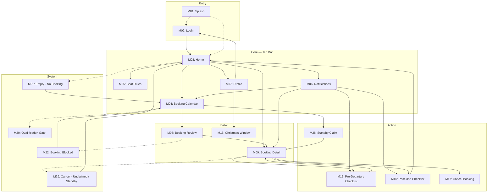
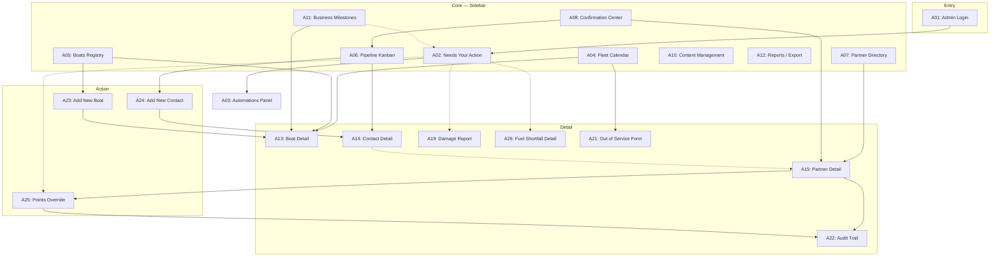
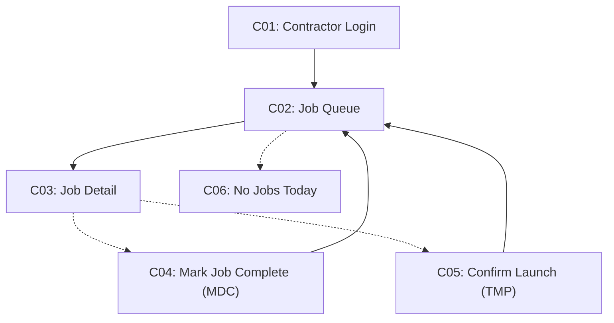

# Offshore Collective — Information Architecture

**Client:** Matt Flanagan · **Source:** SOW "Scope of Work (v1.4.2026), After kickoff", the primary scope reference
**Prepared:** 2026-08-31 · **Reconciled:** 2026-09-17 against the SOW's live Scope Details and Acceptance Criteria (struck rows skipped)
**Status:** the screen inventory below is current. Screens whose scope the SOW has struck were deleted outright rather than marked, per the project rule that removed items are treated as gone, not carried as background context. Read this file as the list of what exists, not as a record of what changed.

Three separate surfaces, each with its own navigation pattern:

| Surface | Users | Platform |
|---|---|---|
| **Partner Mobile App** | Boat-owning partners (up to 6 per boat) | iOS + Android, portrait only |
| **Admin Portal** | Matt (single admin user) | Web, desktop-first |
| **Contractor Mini-Portal** | TMP (launch) & MDC (cleaning) contractors | Web, restricted access |

---

## PART 1 — PARTNER MOBILE APP

### 1. Navigation Pattern Decision

```
Primary navigation: Tab Bar (4 items — Home, Book, Rules, Profile)
Reason: Partners' core recurring needs (check points, make a booking, check
rules, manage account) are peer-level and equally frequent — tab bar gives
1-tap access to all four, comfortably inside the iOS/Android 5-item limit.
Notifications is NOT a tab: it is an inbox the partner visits on a prompt,
not a destination they navigate to unprompted, so it sits as a bell icon in
the Home top bar with an unread dot. That also keeps the bar at 4 items,
which removes the 320pt crowding risk a 5th labelled item created.
Secondary navigation: Profile screen menu carries Christmas Window, Support
and the legal pages. There is no money screen to route to: SOW C.26 requires
the platform to hold no financial data at all.
Platform notes: Portrait-only per scope note. iOS uses implicit swipe-back;
Android uses system back gesture. Neither platform needs a hamburger drawer.
```

### 2. Screen Inventory

| ID | Screen Name | Category | Entry from | Exits to | Auth | Notes |
|---|---|---|---|---|---|---|
| M01 | Splash / Session Check | Entry | App launch | M02, M03 | No | Routes based on remembered session |
| M02 | Login | Entry | M01, M07 (sign out) | M03; ⇢M23 | No | |
| M03 | Home / Dashboard | Core (tab) | M01, M02, M16 | M04,M05,M06,M07,M09; ⇢M21 | Yes | Points balance, boat card with ready status (C.31), upcoming bookings. A claimed standby day (A.19) lists here too, sorted first because it is always today, which is what keeps that booking and its C.30 dialog reachable |
| M04 | Booking Calendar | Core (tab) | M03, M21 | M08; ⇢M20 | Yes | Gated by qualification status |
| M05 | Boat Rules | Core (tab) | M03 | [Terminal] | Yes | Static, read-only, grouped by topic |
| M06 | Notification Center | Core (tab) | M03 | M09, M15, M16, M04 | Yes | Every row deep-links straight to its destination. No detail screen sits in between: A.14 scopes this as a list view and the message is complete on the row (see the audit below). The A.2 qualification welcome is the one entry that is not a row, see below |
| M07 | Profile | Core (tab) | M03 | M13,M25,M26,M27,M02 | Yes | One identity card (name, boat, Edit, then qualification / phone / email as rows), then the padlocked "Secondary operator" card, then the menu. Editing happens in place on this screen, there is no separate edit screen to navigate to (A.16). Support contact repeated in the footer per A.17 |
| M08 | Booking Review & Confirm | Detail | M04 | M09; ⇢M22 | Yes | Points-cost calc plus estimated departure time, shown before confirm |
| M09 | Upcoming Booking Detail | Detail | M08, M03, M28, M06 | M17, M15, M16 | Yes | Two states: Confirmed, and Checked Out once M15 is submitted. Checked Out drops the cancel action (nothing left for C.30 to settle) and its single CTA is the only drawn entry into M16 |
| M13 | Christmas Window Display | Detail | M07 | [Terminal] | Yes | 3-year term view, one assigned window; partner-triggered release (A.12) |
| M15 | Pre-Departure Checklist | Action | M09, C.32 reminder | M09 (submit) | Yes | 4 fuel fields, damage, estimated return time; no approval gate |
| M16 | Post-Use Checklist | Action | (triggered post-trip, from M06/M09) | M03 (submit → turnaround starts) | Yes | |
| M17 | Cancel Booking | Action | M09 | M03 (confirm) | Yes | Three variants, one per booking type, per C.30. Advance booking: 48h refund rule. Unclaimed-access (M29): always forfeits. Standby (M29): nothing to forfeit, contractor stood down |
| M20 | Qualification Pending Gate | System | M04 (dashed) | M03 (back only) | Yes | Blocks booking access — see audit |
| M21 | Empty — No Upcoming Booking | System | M03 (dashed) | M04 | Yes | |
| M22 | Booking Blocked (Rule Violation) | System | M08 (dashed) | M04 | Yes | Shows needed vs. remaining points |
| M23 | Sign-in Error | System | M02 (dashed, inline) | M02 | No | Generic message, no field-specific hint |
| M24 | Offline / Connection Error | System | any (dashed) | retry current screen | — | |
| M25 | Terms & Conditions | Utility | M07 | [Terminal] | Yes | Client-provided legal text |
| M26 | Privacy Policy | Utility | M07 | [Terminal] | Yes | Client-provided legal text |
| M27 | Support Contact | Utility | M07; persistent navbar icon on every authenticated screen | [Terminal] | Yes | Name/phone/email, admin-managed, partner cannot edit. Also repeated in the Profile footer, which is where A.17 puts it |
| M28 | Standby Claim | Action | M04 (today cell only, Mon to Thu, after 7am, when unclaimed) | M09 (claimed) | Yes | Zero points, first-confirmed, captures estimated departure time for C.28's real-time TMP alert |
| M29 | Cancel — Unclaimed / Standby | System | M09 (dashed) | M03 | Yes | The two C.30 cancellation confirmations that do not follow the 48-hour rule |

### 3. Sitemap



### 4. Content Hierarchy — Core Screens

**M03 — Home / Dashboard**
- Primary: points balance (always labelled points, never days, per A.3) · boat card carrying the persistent ready status (C.31, three states since 2026-09-19: ready / not ready yet / absent, where "not ready yet" shows only on a day the partner has a booking) · upcoming bookings, up to the 2 a partner can hold
- Secondary: support and notification icons in the top bar, the latter with an unread dot
- Tertiary: —
- Absent: full booking history (lives in M09/booking list); anything financial, which C.26 forbids outright — dashboard stays glanceable

**M04 — Booking Calendar**
- Primary: calendar grid with a **six-state** legend (available / holiday long weekend / unclaimed / standby-available / blocked / booked) · date-range selector · month stepper, since the 60-day window spans more than one month. Past dates and dates beyond the window share one muted, unlabelled treatment. Cut from seven states on 2026-09-17, because seven tints put every fill pair below 3:1 and made the grid unreadable for the 40-to-60 demographic the product is written for; the C.7 named-holiday long weekend was then restored the same day per Matt's M04 comment, carried by a 3px top rule across the span rather than by fill, since no light tint can reach 3:1 against the other light states. Christmas Window dates are **not** marked on this grid: the window is a one-time admin draw and not partner-selectable, so it belongs to M13.
- Named holidays are both marked and named: the long-weekend span carries the holiday tint on the grid, and a key directly below the grid repeats the same swatch beside the holiday name and date range, so the colour resolves to a name. A named holiday that forms no long weekend that year (Waitangi or ANZAC falling midweek, per confirmed Open Questions for Client #17) appears in the key as a single named day and takes no cell treatment at all.
- Secondary: booking-type cost shown on selection (1 / 5 / 7 / 14 pts, or the C.5 unclaimed rate, which can be zero for a day claimed after 7am on the day itself) · a live rule note explaining any repricing or block
- Tertiary: full rule text (links out to M05)
- Absent: points balance detail (shown at M08, not here, to avoid duplicating the hard-block moment)
- **Standby** appears on today's cell only, after 7am, only when nothing confirmed covers it (A.19), and only when today is Monday to Thursday (2026-09-19: no weekend turnaround capacity, so Fri to Sun stay on C.5 unclaimed pricing). It is the one cell that leads somewhere other than M08: it opens M28.

**M05 — Boat Rules**
- Primary: rules grouped by topic (points & reset, booking types & cost, timing limits, standby, unclaimed-weekend rates, fairness, cancellation, Christmas Window)
- Secondary: —
- Tertiary: expandable detail per topic
- Absent: any editable content (admin-only via A10)

**M06 — Notification Center**
- Primary: chronological list — type icon, message, timestamp, read/unread state. Every row is a deep-link and its whole message is visible on the row
- Primary: the A.2 qualification welcome, pinned at the top as a card rather than a row (confirmed 2026-09-18). Heading, one-paragraph body and a single action into M04. It is the only notification that marks a milestone rather than reporting a routine update, which is why it does not share the row format. Fires once per partner at the moment Matt confirms qualification in B.21, never repeats
- Secondary: filter by type (optional, not explicitly scoped — flagged below)
- Tertiary: —
- Absent: push-permission settings (native OS setting, not in-app); a notification-detail screen, removed 2026-09-17, see the audit below
- Deep-link map: qualification welcome (A.2) → M04, since booking access is the thing that just changed · booking confirmed → M09 · boat ready (C.31) → M09 · pre-departure reminder (C.32) → M15 · post-use reminder (C.32) → M16 · weekend reopened (C.5/C.9) → M04, with the reopened block already selected and repriced · Christmas Window released (C.8/C.9) → **no destination exists yet**, see the audit below

**M07 — Profile**
- Primary: one identity card holding the partner's name, the vessel beneath it, an inline Edit control, and then qualification, phone and email as rows. The name is the screen's title at 25px (2026-09-19); the vessel is its own two-line unit, boat name over model, behind the same boat mark the Home card uses, rather than the single grey "Halcyon · Rayglass 3000" run it was until then. A name and a model number are different kinds of fact and the middle dot was claiming they were the same one. Qualification is the first row because it is the one value that decides whether booking is available at all. Activating Edit turns the name into an input in place, with Cancel/Save; no navigation happens and nothing on the screen moves. Neither phone nor email is editable here (email 2026-09-18, phone 2026-09-19): Matt maintains both on the shareholder record via A07/A15, so both render as rows in both modes, the same boundary Qualification and the Secondary operator sit on. Name is the only value a partner changes from this screen, which is why the edit control is a pencil sitting against the name rather than a labelled button at the card corner. The rows carry no explanation of how phone or email get changed (a line saying so was added and removed on 2026-09-19): the support contact in the footer is the route, unlabelled
- Note: name, qualification and contact were three separate blocks with two headings above them until 2026-09-17. They are one card now, which is ~150px shorter and puts the menu inside the first screenful; the group heading is gone because the card opens with the partner's own name
- Primary: "Secondary operator" card, padlocked and read-only in both modes, its heading inside the card rather than floating above it. Empty state shows "None added" on the heading line plus one line on what the field is for; populated state shows all three values A.16 names, name, contact, and Powerboat Training NZ status, with a closing "contact us to change any of these" line
- Secondary: menu links (Christmas Window, Support, T&C, Privacy) · support contact footer (A.17)
- Tertiary: —
- Absent: a separate edit screen (editing is in place, see above), booking history (lives in M09 chain), payment method (no in-app payment exists), any control that edits the secondary operator or qualification (A.16 puts the first with Matt, off-platform; the second is an admin sign-off)

### 5. Entry Points & Dead-End Audit — Mobile

| Screen | Issue type | Description | Fix |
|---|---|---|---|
| M20 | Dead end (by design) | Qualification Pending Gate has no forward path except back | Acceptable as a hard block, but add a CTA — "Contact support" or link to M05 rules explaining the requirement — so it's not a bare stop |
| M06 | Missing system state | No filter/search defined for Notification Center; volume is unbounded over a partner's 3-year term | Confirm with client whether filter-by-type is needed, or accept unlimited scroll |
| M16 | Missing success state | Post-Use Checklist exits straight to M03 with no explicit confirmation screen | Add a lightweight success toast/state before returning home |
| M23/M24 | Note | Modeled as inline states, not full-screen navigations — listed per IA convention that system states must be accounted for | No fix needed, documentation only |
| M06 | **Resolved 2026-09-17** | Five of the six notification rows led nowhere, and the M14 detail screen they were meant to pass through had never been designed | M14 deleted from this inventory rather than built: A.14 scopes the feature as a list view, the message is one line and complete on the row, and a screen between the tap and the destination would be a build with no acceptance criterion behind it. Every row now deep-links to its own target, per the map above |
| M06 | **Open, blocks nothing else** | The Christmas Window release notification (C.8/C.9) is the one row with no destination. C.8 opens a released window to the other five partners first-confirmed, but M13 shows only your own window and M04 carries no Christmas state, so there is nowhere to claim it | Needs Matt's call: a seventh calendar state on M04, or a claimable block on M13. Row left deliberately inert in the deck until then |
| M09 | **Resolved 2026-09-17** | The Checked Out state existed only as prose in a screen note, which left M16 (the trigger for the entire turnaround workflow) with no drawn entry anywhere | Checked Out drawn as its own screen, cancel action dropped, single CTA into M16. The C.32 post-use reminder is the second entry |
| M03 | **Resolved 2026-09-17** | A claimed standby day never appeared on Home, so M28 exited to M09 exactly once and the booking became unreachable as soon as the partner tapped Home, taking the C.30 stand-down dialog with it | Today's claim now lists on Home, sorted first |

**Tap-depth check:** Login → Home = 1 step ✓. Home → core feature = 1 tap (tab bar) ✓. Core feature → Detail = 1 tap ✓. Any screen → Profile = 1 tap ✓. Passes the mobile depth rule.

---

## PART 2 — ADMIN PORTAL

### 1. Navigation Pattern Decision

```
Primary navigation: Sidebar nav (9 top-level sections — exceeds the
practical ~7-item comfort limit for a top nav bar, and matches the
"SaaS dashboard / data-heavy admin tool" pattern).
Reason: Matt is a single power-user who needs persistent, always-visible
access to every section — this is an operations console, not a
content/marketing site.
Secondary navigation: Tabs within Boat Detail (Overview / Engine
Servicing / Christmas Draw) and within Content Management (Checklist
Builder / Boat Rules & Support Contact Editor).
Platform notes: Web. URLs should mirror the sidebar hierarchy
(/boats/:id, /partners/:id) so Needs-Your-Action email/push alerts can
deep-link straight to the relevant record.
```

### 2. Screen Inventory

| ID | Screen Name | Category | Entry from | Exits to | Auth | Notes |
|---|---|---|---|---|---|---|
| A01 | Admin Login | Entry | App launch | A02 | No | |
| A02 | Needs Your Action Feed | Core | Sidebar, A01 | A03; ⇢A19,A21,A25,A26 | Yes | Prioritised list, dual mark-as-done behavior. Also carries the Business Milestone reminders (B.26), the C.29 standby prior-day-use alert, and the close-the-outgoing-card action that A06 no longer shows by default (B.1/B.18) |
| A03 | Tomorrow's Automations Panel | Core | Sidebar, A02 (tab) | [Terminal] | Yes | Read-only + cancel-if-not-fired |
| A04 | Fleet Calendar | Core | Sidebar | A13; A21 | Yes | Toggles to Priority Queue list view in place |
| A05 | Boats Registry (List) | Core | Sidebar | A13; A23 | Yes | |
| A06 | Pipeline Kanban Board | Core | Sidebar | A14; A24 | Yes | 7 stages, but the default view shows the 6 in-flight ones: Active Partner is excluded and returns via a toggle (confirmed 2026-09-18). Cards move on a manual drag or on a confirmation in A08, never on their own. A manual backward drag is a board move only and does not reverse the A08 confirmation record (B.18) |
| A07 | Partner Directory | Core | Sidebar | A15 | Yes | Co-owner partners, with a single search field (name/phone/email). Contact fields edit in place on A15; qualification and capital call stage are not editable here, they come from A08 (B.19) |
| A08 | Manual Confirmation Center | Core | Sidebar | A15 | Yes | Stage 1/2/3 capital calls + qualification sign-off. A CRM status action only: confirming advances the Pipeline card and stores no dollar figure. Carries the only Undo in the system, on a just-confirmed item (B.21) |
| A10 | Content Management | Core | Sidebar | [Terminal, in-place edits] | Yes | Checklist Builder + Boat Rules Editor tabs |
| A11 | Business Milestones Panel | Core | Sidebar | A13; ⇢A02 | Yes | Alerts at Month **30/32/35/36** per boat, from boat delivery date; reminder-only, admin-only, surfaced in the existing Needs Your Action feed (B.26) |
| A12 | Reports / Export | Core | Sidebar | [Terminal, downloads file(s)] | Yes | Two report types only (Bookings & Utilisation, Partner Status). Excel primary, PDF secondary. One file per boat, never combined (B.27) |
| A13 | Boat Detail | Detail | A05, A04, A11 | [Terminal, tabs edit in place] | Yes | Tabs: Overview / Engine Servicing / Christmas Draw |
| A14 | Contact Detail | Detail | A06 | ⇢A15 | Yes | Promotes to Partner Detail once Active |
| A15 | Partner Detail | Detail | A07, A08, A14 (dashed) | A22; A25 | Yes | Edits in place (confirmed 2026-09-18): name, phone, email, and the secondary operator the partner cannot edit in-app (A.16). The two status fields stay read-only here, A08 owns them (B.19) |
| A16 | Operating Partners Directory | Detail | Sidebar | A17; A29 | Yes | Full CRUD on contractor records (confirmed 2026-09-18). Add via A29; edit in place on A17; delete only while a contractor has no activity, otherwise archive (B.20) |
| A17 | Operating Partner Detail | Detail | A16 | [Terminal, edits in place] | Yes | Activity log + urgency flag. Fields edit in place, no separate edit screen: name/company, contact person, phone (C.28 SMS), email (C.11 emails), service role (C.10 routing). Delete or archive action lives here (B.20) |
| A29 | Add Operating Partner | Action | A16 | A17 (on save) | Yes | New 2026-09-18. Same five fields as A17. Mirrors A24 Add New Contact rather than inventing a second add pattern (B.20) |
| A19 | Damage Report Detail | Detail | A02 | [Terminal] | Yes | Boat/booking/description/photo |
| A21 | Out of Service Block Form | Detail | A04 | A04 (save) | Yes | Maintenance/Repair/Admin hold |
| A22 | Audit Trail | Detail | A15 | [Terminal] | Yes | Points overrides + pipeline overrides |
| A23 | Add New Boat (Guided Flow) | Action | A05 | A13 (on save) | Yes | Auto-creates 6 partner slots |
| A24 | Add New Contact | Action | A06 | A14 (on save) | Yes | Auto-creates Pipeline card + Mailchimp contact |
| A25 | Manual Points Override | Action | A15 | A22; A15 | Yes | Mandatory audit trail. Exempt from the negative-balance hard block that applies to partners (B.23) |
| A26 | Fuel Shortfall Detail | Detail | A02 | [Terminal] | Yes | Shows the raw litres short, the boat and the booking. No pricing, no admin fee, no billing record (B.24). Matt settles it outside the platform |
| A27 | Empty State | System | A08, A04 (dashed) | [Terminal, contextual] | Yes | e.g. no pending confirmations |
| A28 | Offline / Error | System | any (dashed) | retry current screen | — | |

### 3. Sitemap



### 4. Content Hierarchy — Core Screens

**A02 — Needs Your Action Feed**
- Primary: prioritised item list (type, boat/partner, age) · mark-as-done checkbox per item · visual distinction between action-tied vs. reminder-only items
- Secondary: item detail preview on click
- Tertiary: —
- Absent: historical/cleared items (would need a separate log view — not currently scoped; flagged below)
- Primary: the close-the-outgoing-card action for an upgrading partner. It exists because A06 hides Active Partner by default, so the card that owes this action is not on screen. Ticking it confirms the outgoing boat's settlement and closes that card, which releases the new card to reach Active Partner. Action-tied, so the tick performs it; logged to the Pipeline audit trail; not a B.21 confirmation, so B.21's Undo does not cover it (B.1/B.18)

**A04 — Fleet Calendar**
- Primary: calendar grid across all boats · urgency flags (Red/Orange/Standard) · view toggle to Priority Queue list
- Secondary: Out of Service labels, standby claims (which appear same-day and so arrive after the nightly contractor email has gone out)
- Tertiary: per-boat filter
- Absent: financial data (kept separate per the strict per-boat data-separation rule)

**A05 — Boats Registry (List)**
- Primary: boat name, Hull Identification Number, status (Ordered/Active/etc.), boat model (Rayglass 3000; the model is read from the consolidated Boat Model configuration, B.15, not hardcoded)
- Secondary: quick status filter
- Tertiary: —
- Absent: anything financial. C.26 requires the platform to store no financial data at all, so there is no reserve balance, invoice or dollar figure anywhere in the registry

**A06 — Pipeline Kanban Board**
- Primary: 7-stage columns · cards (contact name, boat interest) · support for one contact holding 2 simultaneous cards (upgrades)
- Primary: the default view is the working pipeline, the 6 stages where something is still in flight. Active Partner is excluded, because a settled partner has nothing left to track here and at fleet scale those cards crowd out the live ones. A toggle brings them back on demand, and the permanent record is in A07/A15 either way (confirmed 2026-09-18)
- Absent: any board-level exception for an upgrading partner's outgoing Active card. Hiding Active Partner would otherwise hide the one action that card still owes, confirming the outgoing boat's settlement so the new card can reach Active Partner. That action is raised in A02 instead, which is where every manual action already lives. The board stays free of special cases (B.1/B.18)
- Secondary: card age/staleness indicator
- Tertiary: audit trail of stage overrides (drills to A22-equivalent per-card history). A manual backward move is logged here as a manual move, and the A08 confirmation it appears to contradict stays on record, because a drag does not reverse a confirmation (B.18, confirmed 2026-09-18)
- Absent: any dollar figure. A card advances when Matt confirms a capital call in A08, which is a status action carrying no payment data (B.18/B.21)
- Absent: any way to undo a confirmation from this board. Dragging a card back does not touch the confirmation record, which is what would leave the board and the confirmation disagreeing. Reversal lives in A08, and it moves the card back itself (B.18/B.21)

**A07 — Partner Directory** · **A15 — Partner Detail**
- Primary: partner name, qualification status, capital call stage status (stage only, never a dollar figure, per B.19)
- Primary (A15): the partner's contact fields, editing in place (confirmed 2026-09-18): name, phone, email, and the optional secondary operator (name, contact, Powerboat Training NZ status). This is the only screen in the platform where a partner's details can be maintained after onboarding, and it is where Matt actions the secondary-operator change that M07 tells the partner to phone in about (A.16)
- Secondary: boat assignment
- Tertiary: —
- Absent: an edit affordance on qualification status or capital call stage. A08 owns both, and its Undo is the only way to reverse a confirmation, so an edit control here would be a second, unlogged path to the same state. They render as status, not as fields
- Absent: any dollar figure against a capital call stage, before or after an edit (C.26)

**A08 — Manual Confirmation Center**
- Primary: pending queue — Stage 1/2/3 capital call confirmations + qualification sign-offs. Confirming advances the partner's Pipeline card automatically (B.18/B.21), and a qualification confirmation also fires the partner's one-time welcome notification (A.2)
- Primary: an Undo action on a just-confirmed item (confirmed 2026-09-18). It returns the item to the pending queue, moves the Pipeline card back to its previous stage, and writes the reversal to the audit trail against the admin who performed it. This screen is the only place in the system where a confirmation can be reversed
- Secondary: linked partner/boat context
- Tertiary: —
- Absent: automatic confirmation (explicitly manual-only per scope)
- Note: what Undo is on the partner side is not cosmetic. Reversing a qualification sign-off returns the partner to pending and re-locks booking access (A.2), and reversing a Stage 2 clears the boat's Ordered milestone if the six confirmed slots drop below six (B.10). The design of this queue should make that visible before the admin taps Undo, not after

**A16 — Operating Partners Directory** · **A17 — Operating Partner Detail** · **A29 — Add Operating Partner**
- Primary (A16): list of operating partners, each row carrying its service role and any live urgency flag, plus an Add action into A29
- Primary (A17): the five record fields, editing in place, with the activity log beneath them. Per the project's editing rule, there is no separate edit screen: the fields become inputs where they already sit
- Primary (A17): the delete action, which resolves to one of two outcomes and says which before it is confirmed. No recorded activity, the record is deleted. Any recorded activity, the record is archived, keeping the activity log and dropping out of assignment lists
- Secondary: urgency flag history through the activity log
- Absent: GPS or location data on a contractor, an explicit quotation exclusion. Absent too: any contractor-facing view of these records, contractors see only the Mini-Portal (C01 to C06)
- Note: the five fields are not cosmetic. Phone feeds C.28's real-time standby SMS, email feeds C.11's daily and weekly contractor emails, and service role is what C.10 branches on to route a clean to MDC and a launch confirmation to TMP. A record missing any of them breaks a workflow that is already built

**A10 — Content Management**
- Primary: Checklist Builder (add/edit/delete/reorder, fuel+damage fields locked in structure, labels editable) · Boat Rules Editor · Support Contact editor (name, phone, email, which feeds the app footer per A.17)
- Secondary: —
- Tertiary: —
- Absent: —

**A11 — Business Milestones Panel**
- Primary: per-boat timeline showing Month 30/32/35/36 markers against the boat's delivery date · current stage flag. Month 30 renewal conversations, Month 32 firm decisions, Month 35 right of first refusal, Month 36 off the active fleet (B.26)
- Secondary: link into Boat Detail (A13) for the boat behind a given milestone
- Tertiary: —
- Absent: partner-facing view. Admin-only and reminder-only, confirmed by Matt 2026-09-14

**A12 — Reports / Export**
- Primary: report-type picker, **two types only** (Bookings & Utilisation, Partner Status) · filters (date range, boat, partner) · export action (Excel .xlsx primary, PDF secondary for anything sent to a partner)
- Secondary: per-boat file split confirmation before download (data-separation rule, C.26)
- Tertiary: —
- Absent: contractor activity and exit-pipeline reports (deferred to a future phase); financial reports (out of scope entirely, the platform holds no financial data); scheduled or emailed delivery (on-demand only); contractor access

### 5. Entry Points & Dead-End Audit — Admin

| Screen | Issue type | Description | Fix |
|---|---|---|---|
| A05, A06 | **Missing system state — search/filter, partly resolved 2026-09-18** | The QA note in the pricing section references load-testing at **100–150 boats / 600–900 partners**, but no search or filter utility was scoped anywhere except inside Reports/Export. At that scale, unfiltered lists are unusable. | **A07 is now resolved:** a search by name, phone or email is scoped on the Partner Directory (B.19), because A06 no longer shows Active Partner cards by default and the directory became the only route to a settled partner. **A05 Boats Registry and A06 Pipeline Board still have none** — still worth raising |
| A02 | Missing system state | No "cleared/history" log for Needs Your Action items once marked done | Confirm whether Matt needs an audit view of resolved items, or if they can simply disappear |
| A17 | **Resolved 2026-09-18** | Operating Partner Detail had no edit action defined, only view + activity log. This note asked whether the records needed to be editable | Matt confirmed full add, edit and delete from the directory. A17 now edits in place, A29 added for the add flow, and delete is guarded: outright only while a contractor has no activity, archive once they do, so the turnaround history in C.10/B.32/B.33 keeps the contractor it refers to (B.20) |
| A11 / A12 | Resolved | Structure and behavior now defined by independent analysis (see `02-resolved-open-questions-scope.md`) — no longer blocking | Safe to proceed to user flows / visual design; still send the original 19 questions to Matt for sign-off in parallel |

---

## PART 3 — CONTRACTOR MINI-PORTAL

### 1. Navigation Pattern Decision

```
Primary navigation: Hub & Spoke (no cross-section navigation needed —
each contractor type does exactly one thing).
Reason: Deliberately restricted portal. MDC has one action (mark job
complete); TMP has one distinct action (confirm launch). Neither needs
to browse unrelated sections.
Secondary navigation: none — flat, single list + detail.
Platform notes: Web, separate restricted-access login from Admin/Partner.
```

### 2. Screen Inventory

| ID | Screen Name | Category | Entry from | Exits to | Auth | Notes |
|---|---|---|---|---|---|---|
| C01 | Contractor Login | Entry | App launch | C02 | No | Restricted-access, separate from Admin/Partner auth |
| C02 | Fleet Calendar / Priority Queue (Contractor View) | Core | C01, C04, C05 | C03; ⇢C06 | Yes | Restricted subset of A04, same urgency flags |
| C03 | Job Detail | Detail | C02 | C04 (MDC) / C05 (TMP) | Yes | Branches by contractor role |
| C04 | Mark Job Complete | Action | C03 | C02 | Yes | MDC only — notifies the next partner directly on a back-to-back turnaround; internal hand-off only on a haul-out (B.32/C.10) |
| C05 | Confirm Launch | Action | C03 | C02 | Yes | TMP only — trigger for the "boat ready" partner notification on a haul-out turnaround; not used on a back-to-back, where the boat never leaves the water (B.33/C.10) |
| C06 | Empty — No Jobs Today | System | C02 (dashed) | [Terminal] | Yes | |

### 3. Sitemap



### 4. Content Hierarchy — Core Screen

**C02 — Fleet Calendar / Priority Queue (Contractor View)**
- Primary: assigned jobs list/calendar · urgency flags (Red/Orange/Standard)
- Secondary: —
- Tertiary: —
- Absent: full admin/financial/partner data (explicitly restricted)

### 5. Entry Points & Dead-End Audit — Contractor

No issues found — flat structure, both exits loop cleanly back to C02, empty state has no orphan risk.

---

## Cross-Cutting Notes

- **Notifications** (mobile push + in-app center) and the **Mailchimp/Claude integrations** are backend/workflow items, not distinct screens — they surface *through* the screens already listed (e.g. M06, A02).
- **Support Contact (M27)** satisfies the WBS AC ("visible wherever a partner might need to reach support") via a persistent icon-button in the navbar of every authenticated mobile screen — the same position/pattern already used for the Notifications bell, not a bottom-of-screen footer bar, since the tab bar already occupies that position on the 4 core screens. Tapping it opens the full Support Contact screen (M27: name/phone/email, admin-managed from the Admin Portal, read-only to the partner). Also reachable via the Profile menu as a secondary path. **Correction (from an earlier design-review pass):** this note previously described Support as a literal footer block; the rendered screens instead built it as a standalone screen reached only from Profile, with no persistent affordance elsewhere — that gap is fixed by the navbar icon specified here (see `screens-preview.html`).
- **A11 Business Milestones Panel** and **A12 Reports/Export** were originally blocked on 19 open questions from the client's "Open Questions for Client" tab. Both are now resolved by independent analysis grounded in precedent elsewhere in the WBS — see `02-resolved-open-questions-scope.md` for the full reasoning and finalized Scope details/AC. These are InApps' proposed defaults pending Matt's sign-off, not confirmed answers, but they no longer block design or estimation work.
- **New finding from this IA pass** (not in the original Open Questions tab): Admin Boats Registry, Partner Directory, and Pipeline Board have no scoped search/filter, despite the WBS explicitly load-testing for 100–150 boats / 600–900 partners. Worth raising with the client alongside the existing open questions.

---

## Suggested Next Step

Feeds into **alice-user-flow** (booking flow, checklist flow, turnaround flow, standby-claim flow, onboarding→qualification flow are the highest-value flows to map next) and **alice-responsive-layout** for the Admin Portal's grid.
