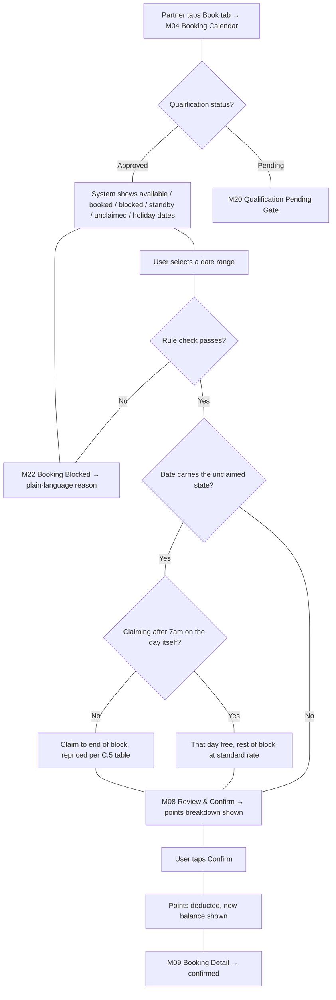
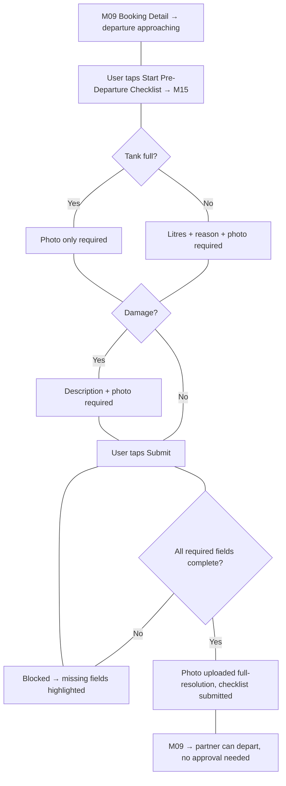
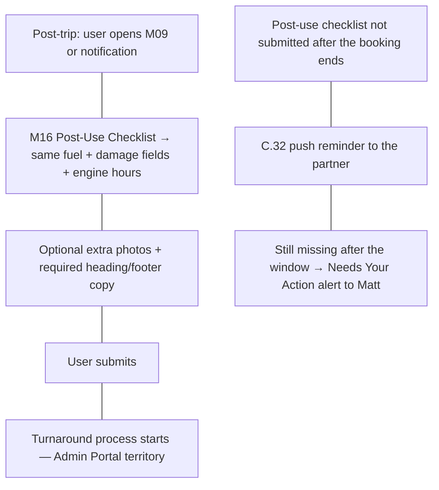
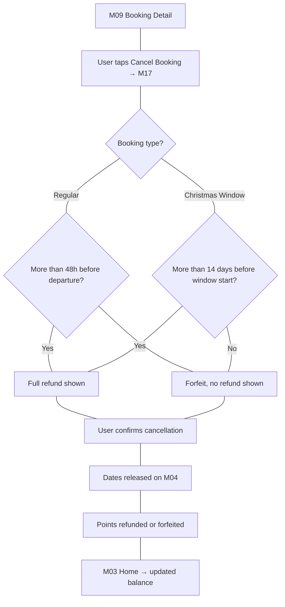
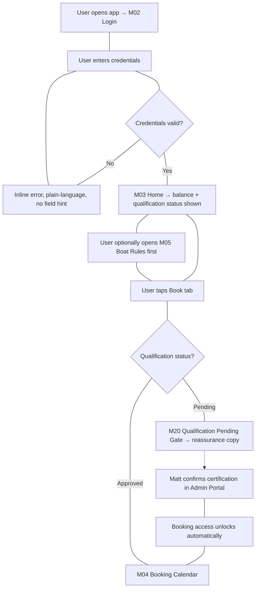
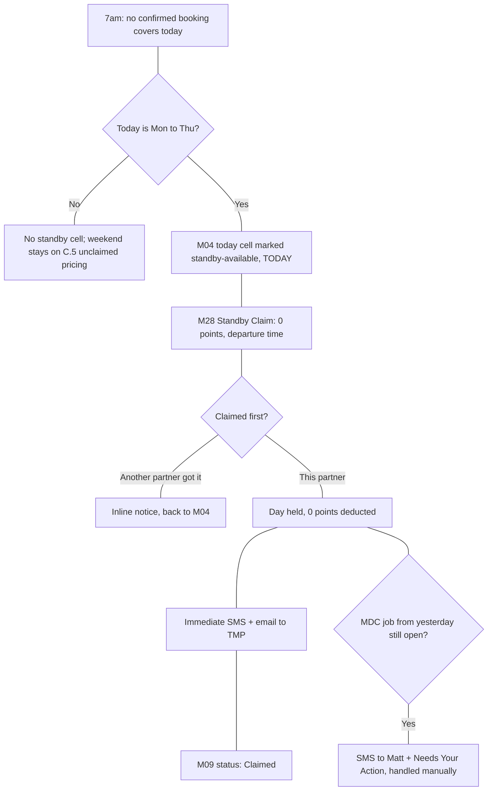

# Offshore Collective — Partner Mobile App User Flows

**Output language:** English · **Platform group:** User App (mobile only — Admin/CMS and Contractor flows out of scope per user instruction)
**Source:** `03-design-brief-parsed.md`, `04-user-personas.md`, Mobile IA in `01-information-architecture.md` (Screen IDs M01–M26)
**Note on file location:** Saved to `design/05-user-flows.md` rather than the skill's default `docs/flows/` path, to keep this pipeline's deliverables together in one directory.

---

## User Roles

| Group | Role | Description | Primary Goal |
|---|---|---|---|
| User App | Guest (unauthenticated) | Anyone who has not signed in | Sign in to reach their account |
| User App | Partner — Qualified | Boat-owning partner whose Powerboat Training NZ certification is confirmed | Book trips, manage checklists, track points |
| User App | Partner — Qualification Pending | Newly onboarded partner awaiting Matt's confirmation | Understand why booking is locked and what happens next |

---

## FLOW-BOOK-01 — Booking Flow (Select Dates → Confirm)

GROUP: User App
FLOW ID: FLOW-BOOK-01
FLOW NAME: Booking Flow
RELATED US: TBD

ACTOR: Partner — Qualified

MAIN FLOW:
1. User opens Booking Calendar (M04) from the tab bar
2. System displays the boat's calendar with available / booked / standby-available / unclaimed / blocked dates, and any C.7 named-holiday long weekend marked across its whole Fri-to-Mon span and named in the key below the grid. Christmas Window dates are not marked here: the window is a one-time admin draw, not partner-selectable, and is presented on M13
3. User selects a date range from the available dates
4. System checks the selection against all active booking rules (points balance, 60-day window, 2-booking/7-day caps, back-to-back block, long-weekend cap) in real time
5. User taps to proceed with a valid selection
6. System navigates to Booking Review & Confirm (M08), pre-populated with the selected dates
7. System displays three numbers: points currently available, points this booking will use, and the balance that would remain after booking
8. User reviews the points breakdown and taps Confirm
9. System deducts the points cost immediately and displays the new balance
10. System navigates to Booking Detail (M09) showing the confirmed booking

END: Partner has a confirmed booking visible at M09, with the new points balance reflected on Home (M03)

ALTERNATIVE FLOWS:
- Case 1: Qualification pending
  - At step 1: User taps the Book tab while qualification status is Pending
  - System: Redirects to Qualification Pending Gate (M20) instead of the calendar, explaining that booking unlocks once Matt confirms the Powerboat Training NZ certification pass — no booking calendar is shown
- Case 2: Selection breaks a booking rule
  - At step 4: The selected dates would take the partner's points balance negative, exceed the 60-day advance window, exceed 2 held bookings or 7 consecutive days, fall within the 7-day back-to-back block, or exceed the long-weekend cap
  - System: Blocks the selection at Booking Blocked (M22), shows a plain-language message naming the specific rule and (for points) the exact points needed vs. remaining, and returns the user to M04 to adjust dates
- Case 3: Selection falls inside a reopened weekend
  - At step 3: The user taps a date carrying the unclaimed state (C.5)
  - System: Selects from that day through to the end of the block rather than the single day tapped, and prices it from the unclaimed table by the day being claimed on (weekend 5/4/2, long weekend 7/6/4/2). It never prices per day, and never splits the block between two partners
- Case 3b: Selection is a lone Friday
  - At step 3: The user taps a Friday that is not part of an intact weekend or long weekend block
  - System: Selects it but refuses to price it, disables Review Booking, and explains that Friday is never booked on its own (C.4). Adding Saturday and Sunday, or continuing to Monday, clears the block
- Case 4: User navigates away before confirming
  - At step 8: User backgrounds the app or taps away from M08 without confirming
  - System: Discards the pending selection — no points are deducted and no booking is held; the dates return to available on M04

UX NOTES:
- Friction point: Case 2's rule-violation message must name the specific rule, not a generic "can't book this" — this is explicitly required by the WBS and matters most for less rule-familiar partners (see persona Priya, who reads rules carefully).
- Improvement: Per the Competitive Brief (R1, Gap 2), keep M04 → M08 feeling like a single continuous motion — pre-populate M08 fully so the only action needed is a Confirm tap.
- Assumption: Step 3's "select a date range" assumes a drag or tap-start/tap-end calendar interaction — the WBS does not specify the exact gesture; this is a screen-design decision for SKILL SC, not fixed here.

DIAGRAM:

---

## FLOW-CHECKLIST-01 — Pre/Post-Departure Checklist

GROUP: User App
FLOW ID: FLOW-CHECKLIST-01
FLOW NAME: Pre/Post-Departure Checklist
RELATED US: TBD

ACTOR: Partner — Qualified, with an upcoming or just-completed booking

MAIN FLOW:
1. User opens Upcoming Booking Detail (M09) for a trip about to start
2. System shows a prompt to complete the Pre-Departure Checklist before departure
3. User taps to start the checklist, navigating to Pre-Departure Checklist (M15)
4. System displays the fuel section: is the tank full (yes/no)
5. User selects "No"
6. System reveals two additional required fields: litres reading and reason-if-not-full, plus the photo of the fuel gauge, which is asked for either way and never blocks submission (Case 3b)
7. User enters the litres reading, types a reason, and uploads a photo
8. System displays the damage section: any damage (yes/no)
9. User selects "No" (damage fields stay hidden since not required)
10. User taps Submit
11. System checks that the tank full/litres/reason fields and the damage yes/no are filled in; the fuel gauge photo is not part of that check
12. System uploads the photo at full resolution (no compression) and submits the checklist
13. System returns the user to M09 — no approval gate blocks departure

END: Checklist submitted, partner can depart immediately; if a fuel shortfall or damage was reported, it's simultaneously flagged into Matt's Needs Your Action feed in the Admin Portal (outside this app)

ALTERNATIVE FLOWS:
- Case 1: Tank is full
  - At step 5: User selects "Yes" for tank full
  - System: Skips the litres-reading and reason fields — the full-resolution photo of the fuel gauge is still asked for, since it is wanted whether the tank is full or not, but it does not block the submit (Case 3b)
- Case 2: Damage reported
  - At step 9: User selects "Yes" for damage
  - System: Reveals required description and photo fields; checklist cannot submit until both are filled
- Case 3: Required field left blank
  - At step 10: User taps Submit with the tank full/litres/reason fields or the damage yes/no missing
  - System: Blocks submission and highlights the missing field(s) — checklist cannot be submitted until all are complete
- Case 3b: Fuel gauge photo left off (confirmed 2026-09-18)
  - At step 10: User taps Submit with no fuel gauge photo attached, having already left the boat, so the gauge can no longer be photographed
  - System: Submits anyway. The photo never blocks, a soft notice states the consequence, every other field stays mandatory, the submission is flagged "submitted without fuel photo" in Matt's Needs Your Action feed (B.1), and on the post-use checklist the turnaround workflow proceeds normally. The app has no location signal to verify the partner has left, so the absent photo is what carries the waiver, see `12-form-specs.md` §2b
- Case 4: Fuel reading within 20-litre tolerance
  - At step 11 (system-side, not user-visible): The reported litres differ slightly from the expected reading
  - System: Does not flag a shortfall if the difference is within 20 litres — only a discrepancy beyond that raises a Needs Your Action item
- Case 5: Checklist not submitted
  - At step 2: The partner never opens the checklist
  - System: Nothing blocks departure, there is no approval gate by design (A.9). The system records that no pre-departure check was submitted for that booking. For the post-use checklist the consequence is larger, since it is what starts the turnaround, so C.32 fires a push reminder 1 hour before the estimated return time and alerts Matt in Needs Your Action if it is still missing 2 hours after that time (timings confirmed by Matt 2026-09-18; the pre-departure reminder fires 1 hour before the estimated departure time captured at booking)
- Case 6: Post-Use Checklist (return trip)
  - Entry differs: User opens M09 or a "boat ready to return" notification after using the boat, navigating to Post-Use Checklist (M16) instead of M15
  - System: Uses the identical 4 fuel fields + damage field, adds a mandatory engine-hours reading that feeds the Engine Servicing Registry (A.11/B.14), allows optional extra photos beyond the required set, carries the same fuel gauge photo waiver as pre-departure (Case 3b) with the turnaround still starting normally when the photo is absent, shows specific heading/footer copy about photo usage, and submitting triggers the turnaround process (not covered further here — Admin Portal territory)

UX NOTES:
- Friction point: the fuel section's conditional fields (litres/reason/photo appearing only when "not full") must be visually obvious as newly-required, not easy to miss and get blocked at Submit.
- Improvement: showing the 20-litre tolerance logic to the partner (e.g. "small differences are fine") could reduce anxiety about entering an exact litres figure — currently the WBS doesn't surface this to the partner, only to Matt; flagging as a UX-writing opportunity for SKILL 09.
- Assumption: Step 2's "prompt to complete checklist" (e.g. a banner on M09 vs. a push notification) is not specified in the WBS as a UI mechanism — treated as an assumption for screen design to resolve.

DIAGRAM — Main Path

DIAGRAM — Alternative Paths

---

## FLOW-CANCEL-01 — Cancel Booking

GROUP: User App
FLOW ID: FLOW-CANCEL-01
FLOW NAME: Cancel Booking
RELATED US: TBD

ACTOR: Partner — Qualified, with an existing upcoming booking

MAIN FLOW:
1. User opens Upcoming Booking Detail (M09) for a confirmed booking
2. User taps Cancel Booking
3. System navigates to Cancel Booking (M17) and shows the applicable refund/forfeit rule for this booking based on how close it is to departure
4. User confirms the cancellation
5. System releases the dates back to the calendar
6. System refunds or forfeits the points according to the rule shown
7. System navigates back to Home (M03) showing the updated points balance

END: Booking is cancelled, dates are available again on M04, and the partner sees their correct post-cancellation points balance on M03

ALTERNATIVE FLOWS:
- Case 1: Regular booking, more than 48 hours before departure
  - At step 3: Booking is a regular (non-Christmas-Window) booking and departure is more than 48 hours away
  - System: Shows "full refund" — cancelling refunds all points used for this booking
- Case 2: Regular booking, less than 48 hours before departure (or no-show)
  - At step 3: Departure is less than 48 hours away, or the trip already passed with no checklist submitted (no-show)
  - System: Shows "points forfeited, no refund" before the user confirms
- Case 3: Christmas Window booking, more than 14 days before window start
  - At step 3: The booking is the partner's Christmas Window assignment and it's more than 14 days before the window starts
  - System: Shows "full refund" using the 14-day threshold instead of the 48-hour one
- Case 4: Christmas Window booking, less than 14 days before window start
  - At step 3: Less than 14 days before the Christmas Window starts
  - System: Shows "points forfeited, no refund" using the 14-day threshold
- Case 5: User backs out before confirming
  - At step 4: User navigates away from M17 without confirming
  - System: No cancellation occurs — the booking remains confirmed and unchanged

UX NOTES:
- Friction point: partners like David (points-conscious, per persona) will specifically want to know the forfeit/refund outcome *before* confirming, not after — step 3 showing the rule before the confirm tap is a hard requirement, not a nice-to-have.
- Improvement: since the refund threshold differs for Christmas Window vs. regular bookings, M17's copy must make it unambiguous which rule applies to *this specific* booking, since a partner may hold both types at once.
- Assumption: none — this flow maps directly to WBS-stated rules with no invented behavior.

DIAGRAM:

---

## FLOW-ONBOARD-01 — Qualification-Gated Onboarding

GROUP: User App
FLOW ID: FLOW-ONBOARD-01
FLOW NAME: Qualification-Gated Onboarding (first-ever booking)
RELATED US: TBD

ACTOR: Partner — Qualification Pending → Qualified (transitions mid-flow)

MAIN FLOW:
1. User opens the app for the first time and lands on Login (M02)
2. User signs in with account credentials
3. System verifies credentials and signs the user in
4. System navigates to Home (M03), showing the partner's points balance and profile, with qualification status visible
5. User taps the Book tab, intending to make her first booking
6. System checks qualification status
7. (Qualification already Approved by this point in the main path) System navigates to Booking Calendar (M04) as normal
8. User proceeds with a normal booking (see FLOW-BOOK-01)

END: Partner successfully books her first trip, having understood the rules via Boat Rules (M05) beforehand

ALTERNATIVE FLOWS:
- Case 1: Qualification still Pending at first login
  - At step 6: Qualification status is still Pending (Matt hasn't confirmed the certification pass yet)
  - System: Redirects to Qualification Pending Gate (M20) instead of M04, explaining that booking unlocks automatically once Matt confirms her Powerboat Training NZ certification — no action needed from her
- Case 2: Qualification approved mid-session
  - At step 6 (on a later visit): Matt has since confirmed her qualification in the Admin Portal
  - System: Booking access unlocks automatically the next time she opens or refreshes M04 — no extra action required, per the WBS's "no extra action needed from the partner" rule
- Case 3: Sign-in fails
  - At step 3: Credentials are incorrect
  - System: Shows a plain-language error message that does not reveal which part (email or password) was wrong, and lets her try again on M02
- Case 4: First-time exploration of rules before booking
  - Between steps 4 and 5: Before attempting to book, the user proactively opens Boat Rules (M05) from the tab bar to read the rules in full
  - System: Displays rules grouped by topic — no booking action is required to view this screen

UX NOTES:
- Friction point: Case 1's gate screen is the single most important moment for a first-time user — if it reads as a dead-end error rather than "you're almost there, here's what happens next," it undermines first-session trust. M20's copy needs explicit reassurance, not just a block.
- Improvement: consider whether M03 (Home) should visually surface "Qualification: Pending" as a status chip even before the user taps Book, so she isn't surprised by the gate — flagging for SKILL SC screen design.
- Assumption: The exact mechanism for "unlocks automatically" (push notification vs. silent unlock on next visit) isn't specified in the WBS as a UI behavior — Case 2 assumes a silent unlock discovered on next visit; a confirming notification is a reasonable enhancement but not confirmed in scope.

DIAGRAM:

---

## FLOW-STANDBY-01 — Standby Claim (Same Day, Free)

GROUP: User App
FLOW ID: FLOW-STANDBY-01
FLOW NAME: Standby Claim
RELATED SOW ROWS: A.19, C.27, C.28, C.29, C.30

ACTOR: Partner — Qualified

The only flow in the app where a partner gets time on the boat without spending points, and the only one that races the other five partners in real time.

MAIN FLOW:
1. Today is a Monday, Tuesday, Wednesday or Thursday. Standby never runs Friday to Sunday (confirmed 2026-09-19): Marine Detailing Co has no weekend turnaround capacity, so those days stay on Unclaimed Weekend Access pricing (C.5) instead
2. At 7am the system checks whether any confirmed booking covers today for this boat (regular day, weekend block, long weekend, or Christmas Window)
3. Nothing covers it, so the system opens today as a standby claim at zero points
3. User opens the Booking Calendar (M04) and sees today marked standby-available, with a TODAY marker
4. User taps the cell
5. System navigates to Standby Claim (M28), showing 0 points and a pre-filled estimated departure time
6. User adjusts the departure time if needed and taps Claim Today, Free
7. System allocates the day on a first-confirmed basis and deducts nothing
8. System immediately sends an SMS and an email to Tamaki Marine Park's booking contacts, including the departure time, rather than waiting for the nightly contractor email
9. System navigates to Booking Detail (M09), showing the claim with a Claimed badge

END: Today is held for this partner at no point cost, with Tamaki Marine Park already told

ALTERNATIVE FLOWS:
- Case 1: Another partner claims first
  - Between steps 5 and 6: another partner confirms the same day
  - System: replaces the claim button with an inline notice before this partner can tap it, so a tap never fails after the fact. Single route back to M04
- Case 2: Boat not yet turned around from yesterday
  - At step 7: a post-use checklist exists for yesterday and Marine Detailing Co has not marked their job complete
  - System: SMS to Matt immediately, plus a Needs Your Action entry, flagging that readiness needs manual confirmation (C.29). Matt coordinates with TMP and MDC and tells the partner directly. Nothing about the standard boat-ready notification changes
- Case 3: Partner cancels the claim
  - After step 9: user cancels from M09
  - System: no points to refund or forfeit, but TMP is told to stand down, or to retrieve the boat if it is already launched (C.30). No post-use checklist is expected, and the boat's condition carries forward without a fresh checklist baseline
- Case 4: Partner's balance is zero or negative
  - At step 6
  - System: the claim proceeds. Standby is free, so the hard block on a negative balance (C.4) does not apply

UX NOTES:
- The free price is the whole proposition, so it has to be stated in the button, not only in the body. A partner trained to think every day costs points will otherwise hesitate over a day that costs nothing.
- The estimated departure time is the one thing the partner gives back in exchange. Framing it as a favour to Tamaki Marine Park, rather than as a required field, is why the help text explains what happens to the value.
- Case 1 is the real design risk. Losing a race after tapping would feel like the app took something away; losing it before tapping reads as bad luck. The state change has to arrive before the tap.

DIAGRAM:

---

## Summary

| Group | Flow Name | Actor | # Main Steps | # Alt Cases | Entry Point | End State |
|---|---|---|---|---|---|---|
| User App | Booking Flow | Partner — Qualified | 10 | 4 | M04 Booking Calendar | M09 confirmed booking |
| User App | Pre/Post-Departure Checklist | Partner — Qualified | 13 | 6 | M09 Booking Detail | M09, checklist submitted |
| User App | Cancel Booking | Partner — Qualified | 7 | 5 | M09 Booking Detail | M03 updated balance |
| User App | Qualification-Gated Onboarding | Partner — Pending → Qualified | 8 | 4 | M02 Login | M04/M08 first booking underway |
| User App | Standby Claim | Partner — Qualified | 9 | 4 | M04 Booking Calendar (today cell) | M09 claim held at 0 points |

---

## Open Questions Carried Forward
- ~~For a back-to-back turnaround, where the boat never leaves the water, should Marine Detailing Co's Mark Job Complete trigger the next partner's notification directly?~~ **Answered by Matt 2026-09-18: yes.** On a back-to-back turnaround MDC's Mark Job Complete notifies the next partner directly, and TMP has no step, since there is no launch to confirm. TMP's Launch Confirmed remains the trigger on the haul-out path only. Written into SOW B.32, B.33 and C.10, so "only TMP's Launch Confirmed notifies the partner" is now a haul-out rule, not a universal one.

Google Sheet export was not requested — the Mermaid diagrams above render natively in this Markdown file and would be lost in a Sheets export. Ask if a Sheets copy is wanted later.
